# Test Coverage Analysis vs System Architecture

## Overview
This analysis cross-references the existing test coverage with the system architecture components to identify coverage gaps and strengths.

```mermaid
graph TB
    %% Client Layer with Test Coverage
    subgraph "Client Layer (React SPA)"
        UI[React Components<br/>🟢 Tested]
        Router[React Router<br/>🟢 Tested]
        State[Redux Store<br/>🟡 Partially Tested]
        Apollo[Apollo Client<br/>🟢 Tested]
        UI --> Router
        UI --> State
        UI --> Apollo
    end

    %% Network Layer with Test Coverage
    subgraph "Network Layer"
        HTTP[HTTP/REST API<br/>🔴 Not Tested]
        GraphQL[GraphQL Endpoint<br/>🟢 Tested]
        WS[WebSocket/Real-time<br/>🔴 Not Tested]
    end

    %% Server Layer with Test Coverage
    subgraph "Server Layer (Node.js/Express)"
        App[Express App<br/>🔴 Not Tested]
        Routes[REST Routes<br/>🔴 Not Tested]
        Resolvers[GraphQL Resolvers<br/>🔴 Not Tested]
        Auth[Authentication<br/>🔴 Not Tested]
        Middleware[Middleware Stack<br/>🔴 Not Tested]
        
        App --> Routes
        App --> Resolvers
        App --> Auth
        App --> Middleware
    end

    %% Business Logic with Test Coverage
    subgraph "Business Logic"
        Controllers[Controllers<br/>🔴 Not Tested]
        Models[Data Models<br/>🔴 Not Tested]
        Services[Business Services<br/>🔴 Not Tested]
        
        Controllers --> Models
        Controllers --> Services
    end

    %% Data Layer with Test Coverage
    subgraph "Data Layer"
        MongoDB[(MongoDB<br/>🔴 Not Tested)]
        MySQL[(MySQL/Sequelize<br/>🔴 Not Tested)]
        FileSystem[File System<br/>🔴 Not Tested]
    end

    %% External Services with Test Coverage
    subgraph "External Services"
        Email[Email Service<br/>🔴 Not Tested]
        Analytics[Google Analytics<br/>🟡 Mocked Only]
        CDN[Static Assets<br/>🔴 Not Tested]
    end

    %% Connections
    Apollo -.->|GraphQL Queries<br/>🟢 Tested| GraphQL
    UI -.->|HTTP Requests<br/>🔴 Not Tested| HTTP
    
    HTTP --> Routes
    GraphQL --> Resolvers
    
    Routes --> Controllers
    Resolvers --> Controllers
    
    Controllers --> MongoDB
    Controllers --> MySQL
    Controllers --> Email
    
    UI --> Analytics
    UI --> CDN

    %% Authentication Flow
    Auth -.->|JWT Tokens<br/>🟡 Mocked Only| Apollo
    Auth -.->|Passport.js<br/>🔴 Not Tested| Controllers

    %% Legend
    classDef tested fill:#d4edda,stroke:#155724
    classDef partial fill:#fff3cd,stroke:#856404
    classDef untested fill:#f8d7da,stroke:#721c24
    classDef client fill:#e1f5fe
    classDef server fill:#f3e5f5
    classDef data fill:#e8f5e8
    classDef external fill:#fff3e0

    class UI,Router,Apollo tested
    class State,Analytics partial
    class HTTP,WS,App,Routes,Resolvers,Auth,Middleware,Controllers,Models,Services,MongoDB,MySQL,FileSystem,Email,CDN untested
```



## Test Coverage Summary

### 🟢 Well Tested Components

#### Client Layer - React Components
- **RandomlyRead Routes**: Complete coverage of all 9 therapy routes
  - Beginner/Intermediate/Advanced levels
  - Introduction/Techniques/Practice sections
  - Tab navigation and URL synchronization
- **WordCard Component**: GraphQL integration with useQuery hook
- **RoutinePreview Component**: Query building and error handling
- **Component Integration**: Tab switching, navigation, accessibility

#### Client Layer - Apollo Client
- **Apollo Client 3.x Configuration**: Complete migration testing
- **GraphQL Query Builder**: All parameter combinations tested
- **GraphQL Integration**: Query execution, error handling, caching
- **Authentication Headers**: Bearer token inclusion verified

#### Client Layer - React Router
- **Route Configuration**: All therapy routes validated
- **Navigation**: Tab switching and URL synchronization
- **Authentication Context**: User context switching per route

### 🟡 Partially Tested Components

#### Client Layer - Redux Store
- **Mock Store Setup**: Basic state structure tested
- **State Management**: Limited testing of state updates
- **Action Dispatching**: Some actions tested in integration tests
- **Missing**: Comprehensive reducer testing, action creators, middleware

#### External Services - Google Analytics
- **Mock Implementation**: GA calls mocked in tests
- **Event Tracking**: Basic tracking tested
- **Missing**: Real analytics integration, event validation

#### Authentication Flow
- **JWT Token Handling**: Mocked in tests
- **User Context**: Basic user object validation
- **Missing**: Real authentication flow, token refresh, logout

### 🔴 Untested Components

#### Server Layer (Complete Gap)
- **Express App**: No server-side testing
- **REST Routes**: No API endpoint testing
- **GraphQL Resolvers**: No resolver logic testing
- **Authentication**: No Passport.js strategy testing
- **Middleware**: No middleware stack testing

#### Business Logic (Complete Gap)
- **Controllers**: No business logic testing
- **Data Models**: No model validation testing
- **Services**: No service layer testing

#### Data Layer (Complete Gap)
- **MongoDB**: No database integration testing
- **MySQL/Sequelize**: No word database testing
- **File System**: No file operations testing

#### Network Layer
- **HTTP/REST API**: No REST endpoint testing
- **WebSocket**: No real-time functionality testing

#### External Services
- **Email Service**: No email functionality testing
- **CDN**: No static asset delivery testing

## Detailed Coverage Analysis

### Client-Side Test Coverage

#### Routes Testing (`RandomlyRead.routes.test.js`)
```
✅ Route Configuration (9/9 routes)
✅ Tab Navigation (3/3 levels)
✅ URL Synchronization
✅ Authentication Context
✅ Error Handling
✅ Responsive Behavior
```

#### Component Testing (`RandomlyRead.components.test.js`)
```
✅ Introduction Components (3/3 levels)
✅ Techniques Components (3/3 levels)
✅ Home Component Contexts
✅ Accessibility Compliance
✅ Performance Benchmarks
```

#### Practice Testing (`RandomlyRead.practice.test.js`)
```
✅ Practice Interface
✅ WordCard Integration
✅ Timer Functionality
✅ Routine Selection
✅ Session Workflows
✅ Progress Tracking
```

#### E2E Testing (`RandomlyRead.e2e.test.js`)
```
✅ Complete User Journeys (3/3 levels)
✅ Cross-level Navigation
✅ Accessibility Testing
✅ Error Scenarios
✅ Performance Under Load
```

#### GraphQL Testing
```
✅ Apollo Client Configuration (6/6 tests)
✅ Query Builder Utilities (12/12 tests)
✅ Integration Testing (7/7 tests)
✅ WordCard Component (8/8 scenarios)
✅ RoutinePreview Component (8/8 scenarios)
```

### Server-Side Coverage Gaps

#### Critical Missing Tests
1. **GraphQL Resolvers** (`server/data/resolvers.js`)
   - Word query logic with phonetic filtering
   - Sentence generation with templates
   - Error handling and fallbacks
   - Database query optimization

2. **REST API Routes** (`server/routes.js`)
   - User authentication endpoints
   - CRUD operations for routines
   - Admin functionality
   - Interaction tracking

3. **Authentication System**
   - JWT token generation/validation
   - Passport.js strategies
   - User authorization levels
   - Session management

4. **Database Integration**
   - MongoDB user data operations
   - MySQL word database queries
   - Data consistency and integrity
   - Performance optimization

## Test Coverage Metrics

### Current Coverage by Layer
- **Client Layer**: ~85% coverage
- **Network Layer**: ~30% coverage (GraphQL only)
- **Server Layer**: ~0% coverage
- **Business Logic**: ~0% coverage
- **Data Layer**: ~0% coverage
- **External Services**: ~10% coverage (mocks only)

### Overall System Coverage: ~25%

## Priority Recommendations

### High Priority (Critical Gaps)
1. **Server-Side Unit Tests**
   - GraphQL resolvers testing
   - REST API endpoint testing
   - Authentication middleware testing

2. **Integration Tests**
   - Database integration testing
   - End-to-end API testing
   - Authentication flow testing

3. **Data Layer Tests**
   - MongoDB operations testing
   - MySQL query testing
   - Data validation testing

### Medium Priority
1. **Performance Tests**
   - Load testing for word queries
   - Database performance testing
   - Memory usage monitoring

2. **Security Tests**
   - Authentication vulnerability testing
   - Input validation testing
   - SQL injection prevention

3. **Error Handling Tests**
   - Network failure scenarios
   - Database connection issues
   - Invalid input handling

### Low Priority
1. **External Service Tests**
   - Email delivery testing
   - Analytics integration testing
   - CDN performance testing

2. **Browser Compatibility Tests**
   - Cross-browser testing
   - Mobile device testing
   - Accessibility compliance

## Recommended Test Implementation Plan

### Phase 1: Server Foundation (2-3 weeks)
```bash
# Create server test structure
server/
├── __tests__/
│   ├── resolvers.test.js
│   ├── routes.test.js
│   ├── auth.test.js
│   └── models.test.js
├── test/
│   ├── setup.js
│   ├── helpers.js
│   └── fixtures/
```

### Phase 2: Database Integration (1-2 weeks)
```bash
# Add database testing
server/__tests__/
├── integration/
│   ├── mongodb.test.js
│   ├── mysql.test.js
│   └── graphql-integration.test.js
```

### Phase 3: End-to-End API Testing (1-2 weeks)
```bash
# Add API testing
server/__tests__/
├── api/
│   ├── auth.api.test.js
│   ├── users.api.test.js
│   ├── routines.api.test.js
│   └── graphql.api.test.js
```

### Phase 4: Performance & Security (1 week)
```bash
# Add specialized testing
server/__tests__/
├── performance/
│   ├── load.test.js
│   └── memory.test.js
├── security/
│   ├── auth.security.test.js
│   └── input.validation.test.js
```

## Test Configuration Recommendations

### Server Test Setup
```javascript
// server/test/setup.js
const mongoose = require('mongoose');
const { MongoMemoryServer } = require('mongodb-memory-server');

// In-memory MongoDB for testing
let mongoServer;

beforeAll(async () => {
  mongoServer = await MongoMemoryServer.create();
  const mongoUri = mongoServer.getUri();
  await mongoose.connect(mongoUri);
});

afterAll(async () => {
  await mongoose.disconnect();
  await mongoServer.stop();
});
```

### GraphQL Resolver Testing
```javascript
// server/__tests__/resolvers.test.js
const resolvers = require('../data/resolvers');
const Word = require('../data/connectors');

describe('GraphQL Resolvers', () => {
  test('words query with phonetic filters', async () => {
    const args = {
      vowel: ['A'],
      consonant: ['P'],
      syllables: [2],
      position: 'initial'
    };
    
    const result = await resolvers.Query.words(null, args, mockContext);
    expect(result).toBeDefined();
    expect(result.lexeme).toBeTruthy();
  });
});
```

## Conclusion

The current test suite provides excellent coverage for the client-side React application, particularly for the speech therapy user interface and GraphQL integration. However, there's a significant gap in server-side testing that represents a critical risk for the application's reliability and maintainability.

The recommended testing implementation plan would increase overall system coverage from ~25% to ~80%, providing comprehensive protection for both client and server components while ensuring the speech therapy platform's therapeutic effectiveness and data integrity.