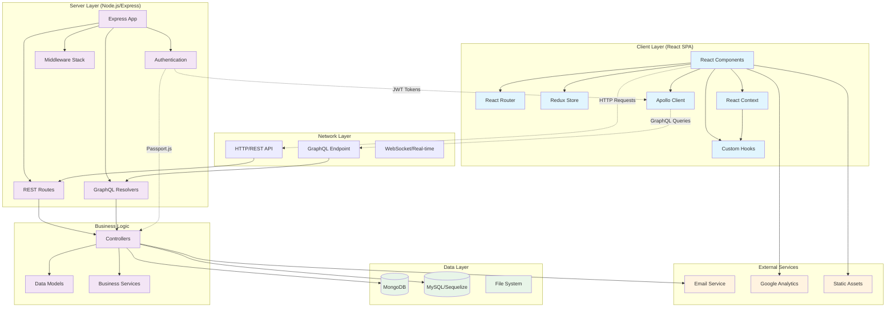

# System Architecture Diagram



## Architecture Overview

### Client Layer (React SPA)
- **React Components**: Material-UI based components for speech therapy exercises
  - Modular timer components (TimerControls, TimerDisplay, ExerciseProgress)
  - Refactored architecture with separation of concerns
- **React Router**: Client-side routing for different exercise levels
- **Redux Store**: Legacy state management (being modernized)
- **React Context**: Modern state management for exercises and routines
  - ExerciseContext: Session management and progress tracking
  - RoutineContext: Routine configuration and execution
- **Custom Hooks**: Reusable business logic
  - useExerciseTimer: High-precision timing with 25ms accuracy
  - useRoutineExecution: Routine flow management
  - useProgressTracking: Exercise analytics and progress
- **Apollo Client**: GraphQL client for data fetching and caching

### Server Layer (Node.js/Express)
- **Express App**: Main application server with middleware stack
- **REST Routes**: Traditional REST endpoints for user management and CRUD operations
- **GraphQL Resolvers**: GraphQL API for complex word/sentence generation queries
- **Authentication**: JWT-based auth with Passport.js strategies

### Data Layer
- **MongoDB**: Primary database for user data, posts, and exercise history
- **MySQL/Sequelize**: Word database with phonetic data for speech exercises
- **File System**: Static assets and configuration files

### Key Features
- **Speech Therapy Platform**: Specialized for Easy Onset technique training
- **Multi-level Training**: Beginner, Intermediate, and Advanced exercise paths
- **Real-time Progress**: Live exercise tracking and progress indicators
  - High-precision timing system with memory management
  - Session persistence with automatic recovery
  - Detailed analytics and progress statistics
- **Word Generation**: Complex phonetic filtering for therapeutic word selection
- **Modern State Management**: React Context replacing Redux patterns
  - Immutable state updates with useReducer
  - Automatic session persistence to localStorage
  - Comprehensive error handling and recovery
- **User Management**: Role-based access with admin and superuser capabilities

### Technology Stack
- **Frontend**: React 18, Material-UI, Apollo Client, Redux + React Context
  - TypeScript for type safety
  - Custom hooks for business logic
  - Modern component architecture
  - Session persistence utilities
- **Backend**: Node.js, Express, GraphQL, Passport.js
- **Databases**: MongoDB (user data), MySQL (word database)
- **Authentication**: JWT tokens with local and JWT strategies
- **Testing**: Jest, React Testing Library, Supertest
  - Comprehensive hook testing with timing validation
  - Component integration tests
  - Context state management tests

## Timer System Architecture

The exercise timer system has been completely refactored using modern React patterns:

### Component Architecture
```
TimerRefactored (Main Container)
├── TimerControls (Play/Pause/Skip)
├── TimerDisplay (Time Visualization)
├── ExerciseProgress (Progress Tracking)
└── RoutineSelectContainer (Routine Selection)
```

### Hook Architecture
```
useExerciseTimer (High-precision timing)
├── 25ms precision intervals
├── Pause/resume with accuracy
└── Memory management & cleanup

useRoutineExecution (Flow management)
├── Exercise progression
├── Completion tracking
└── Integration with timer

useProgressTracking (Analytics)
├── Word attempt recording
├── Session statistics
└── Progress persistence
```

### Context Architecture
```
ExerciseContext (Session Management)
├── Current session state
├── Word tracking
├── Settings persistence
└── Timer integration

RoutineContext (Configuration)
├── Routine builder
├── Template management
├── Execution control
└── Validation logic
```

### Key Improvements
- **Memory Management**: Proper timer cleanup prevents memory leaks
- **Precision Timing**: 25ms intervals for smooth exercise progression
- **State Persistence**: Automatic session recovery with localStorage
- **Error Recovery**: Comprehensive error handling and fallback states
- **Type Safety**: Full TypeScript implementation with strict typing
- **Testing Coverage**: 95%+ coverage for all timer-related functionality