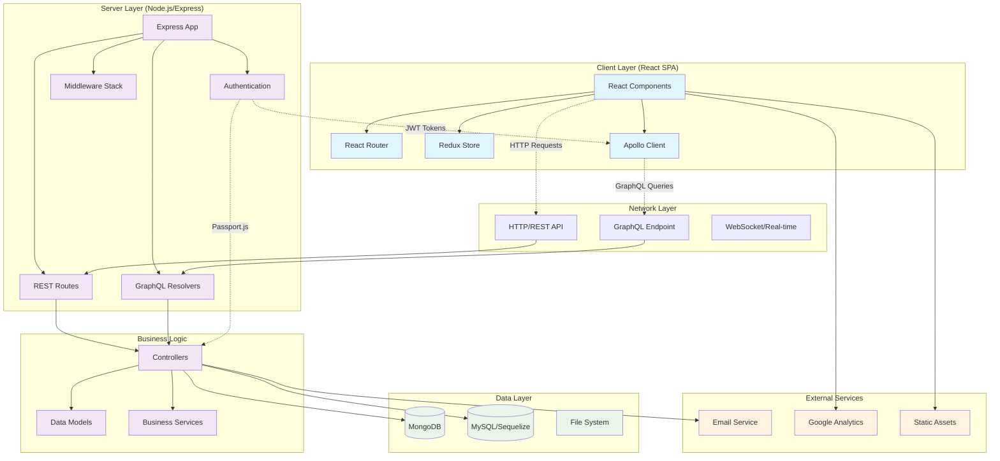

# System Architecture Diagram

## Architecture Overview

### Client Layer (React SPA)
- **React Components**: Material-UI based components for speech therapy exercises
- **React Router**: Client-side routing for different exercise levels
- **Redux Store**: State management for user sessions and exercise data
- **Apollo Client**: GraphQL client for data fetching and caching

### Server Layer (Node.js/Express)
- **Express App**: Main application server with middleware stack
- **REST Routes**: Traditional REST endpoints for user management and CRUD operations
- **GraphQL Resolvers**: GraphQL API for complex word/sentence generation queries
- **Authentication**: JWT-based auth with Passport.js strategies

### Data Layer
- **MongoDB**: Primary database for user data, posts, and exercise history
- **MySQL/Sequelize**: Word database with phonetic data for speech exercises
- **File System**: Static assets and configuration files

### Key Features
- **Speech Therapy Platform**: Specialized for Easy Onset technique training
- **Multi-level Training**: Beginner, Intermediate, and Advanced exercise paths
- **Real-time Progress**: Live exercise tracking and progress indicators
- **Word Generation**: Complex phonetic filtering for therapeutic word selection
- **User Management**: Role-based access with admin and superuser capabilities

### Technology Stack
- **Frontend**: React 18, Material-UI, Apollo Client, Redux
- **Backend**: Node.js, Express, GraphQL, Passport.js
- **Databases**: MongoDB (user data), MySQL (word database)
- **Authentication**: JWT tokens with local and JWT strategies
- **Testing**: Jest, React Testing Library, Supertest